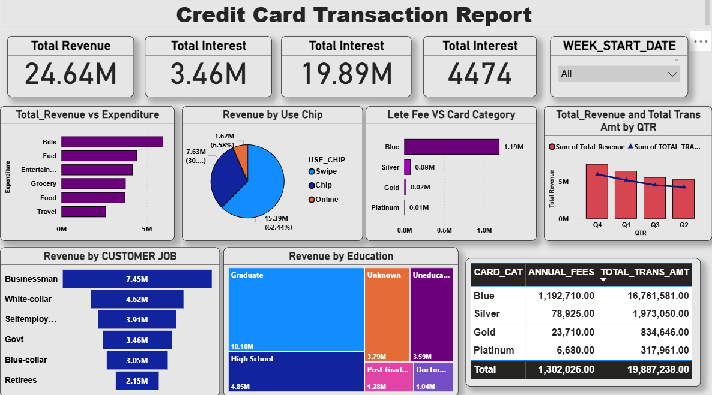

<h1>Credit Card Transaction Report Dashboard</h1>

<!-- Table of Contents -->
<h2>📌 Table of Contents</h2>
<ul>
  <li><a href="#overview">Dashboard Overview</a></li>
  <li><a href="#metrics">Total Metrics</a></li>
  <li><a href="#rev-exp">Total Revenue vs Expenditure</a></li>
  <li><a href="#use-chip">Revenue by Use Type</a></li>
  <li><a href="#late-fee">Late Fee vs Card Category</a></li>
  <li><a href="#quarter">Revenue & Transactions by Quarter</a></li>
  <li><a href="#job">Revenue by Customer Job</a></li>
  <li><a href="#education">Revenue by Education</a></li>
  <li><a href="#card-table">Card Category Summary Table</a></li>
  <li><a href="#files">Project Files</a></li>
  <li><a href="#tools">Tools Used</a></li>
  <li><a href="#purpose">Purpose of the Project</a></li>
  <li><a href="#usage">How to Use</a></li>
  <li><a href="#preview">Dashboard Preview</a></li>
</ul>

<!-- Sections -->

<h2 id="overview">📊 Dashboard Overview</h2>

This Power BI dashboard helps analyze credit-card transactions, customer behavior, and revenue sources.

<h3 id="metrics">1. Total Metrics</h3>
<ul>
  <li>Total Revenue</li>
  <li>Total Interest</li>
  <li>Total Transactions</li>
  <li>Weekly filter to check data by week</li>
</ul>

<h3 id="rev-exp">2. Total Revenue vs Expenditure</h3>

A bar chart showing revenue from categories like:

<ul>
  <li>Bills</li>
  <li>Fuel</li>
  <li>Entertainment</li>
  <li>Grocery</li>
  <li>Food</li>
  <li>Travel</li>
</ul>

<h3 id="use-chip">3. Revenue by Use chip</h3>
<ul>
  <li>Swipe</li>
  <li>Chip</li>
  <li>Online</li>
</ul>

<h3 id="late-fee">4. Late Fee vs Card Category</h3>
<ul>
  <li>Blue</li>
  <li>Silver</li>
  <li>Gold</li>
  <li>Platinum</li>
</ul>

<h3 id="quarter">5. Revenue & Transactions by Quarter</h3>

Shows total revenue and total transaction amounts for each quarter.

<h3 id="job">6. Revenue by Customer Job</h3>
<ul>
  <li>Businessman</li>
  <li>White-collar</li>
  <li>Self-employed</li>
  <li>Government employees</li>
  <li>Blue-collar</li>
  <li>Retirees</li>
</ul>

<h3 id="education">7. Revenue by Education</h3>
<ul>
  <li>Graduate</li>
  <li>High School</li>
  <li>Post-Graduate</li>
  <li>Doctorate</li>
  <li>Uneducated</li>
  <li>Unknown</li>
</ul>

<h3 id="card-table">8. Card Category Summary Table</h3>
<ul>
  <li>Card Category</li>
  <li>Annual Fees</li>
  <li>Total Transaction Amount</li>
</ul>

<h2 id="files">📁 Project Files</h2>
<ul>
  <li>Power BI Dashboard (.pbix)</li>
  <li>Dataset Files</li>
  <li>Dashboard Screenshot</li>
  <li>README File</li>
</ul>

<h2 id="tools">🔧 Tools Used</h2>
<ul>
  <li>Power BI Desktop</li>
  <li>Excel / CSV Data</li>
  <li>Power Query</li>
</ul>

<h2 id="purpose">🎯 Purpose of the Project</h2>
<ul>
  <li>Understand customer spending behavior</li>
  <li>Identify revenue-generating categories</li>
  <li>Analyze card category performance</li>
  <li>Support business decision-making</li>
</ul>

<h2 id="usage">🚀 How to Use</h2>
<ol>
  <li>Download the <strong>Credit_card_Transction_Report_Dashboard.pbix</strong> file.</li>
  <li>Open it in <strong>Power BI Desktop</strong>.</li>
  <li>Explore all charts and filters.</li>
</ol>

<h2 id="preview">📸 Dashboard Preview</h2>

